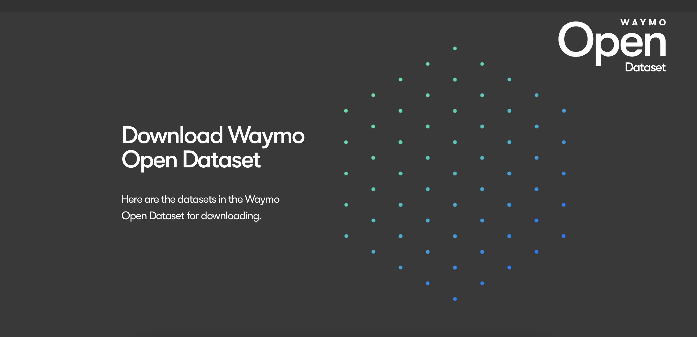
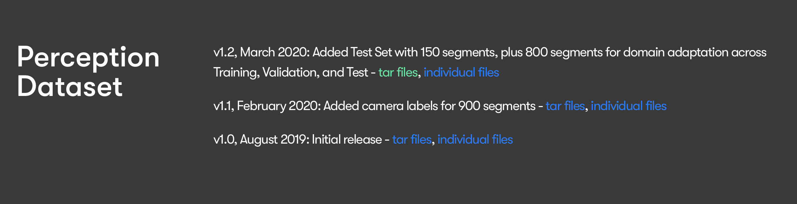

# Waymo Tutorial
This is a step-by-step tutorial detailing how to download the Waymo dataset from Google Cloud Platform.

## Obtaining Access
Before downloading the Waymo dataset, it is necessary to obtain read access to the files.
- In a new Incognito window, navigate to the [Waymo Dataset](https://waymo.com/open/download/#)
  - You will be asked to sign in with your Google account. Supply either your
    school or personal Google account. Note that you DO NOT need to have a
    Google Cloud Platform account beforehand.
  - *Why am I using Incognito?*: Incognito will provide you with a clean session. This will ensure that any existing Google login does not interfere with gaining access to the Waymo dataset on your intended account.
  - Once you've gained access to the dataset, you should arrive at a page that looks something like this: 
  - Scroll down and press the link that in this screenshot, is highlighted in green. 
  - Download the first `.tar` file from each of `training`, `testing`, and `validation`. 
    - **Note: These files are colossal - make sure that you have a great internet connection!**
  - Place the three tar files in `downloader/datasets`, and run `download_processor.py` using `python3 -m downloader.download_processor`.